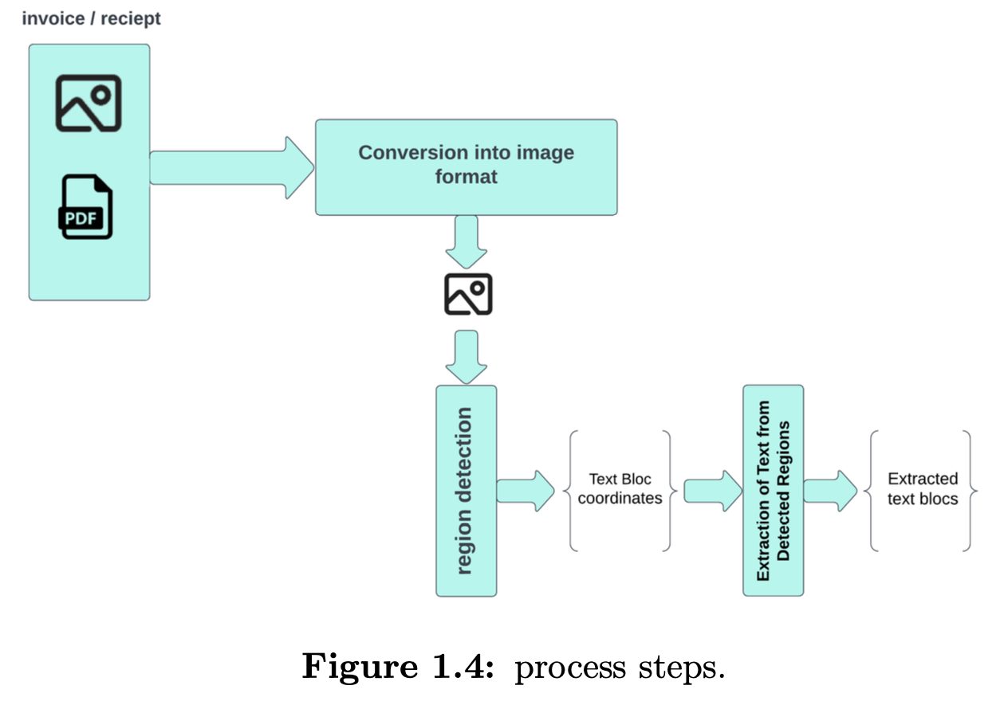

# 🧠 System Architecture

This document describes the **high-level architecture** of the Invoice OCR & Parsing System
and how the different components interact.

The system is based on a **client–server architecture**, adapted to support
machine learning inference and document processing at scale.

---

## 📐 Global Architecture

The system consists of four main components:

---

## 🎨 Frontend — Next.js Server

- Handles user interaction and UI rendering
- Acts as the **middleware / anchor** between the backend and the database
- Sends document processing requests to the Django backend
- Displays inference results to the user
- Allows users to:
  - review extracted fields
  - correct errors
  - save or delete results

---

## 🧠 Backend — Django Server

This is the **heavy-load component** of the system.

Responsibilities include:
- Receiving document uploads from the frontend
- Converting PDFs to images when necessary
- Running a two-stage AI pipeline:
  1. Object detection (YOLO)
  2. Text extraction (Tesseract OCR)
- Managing temporary files during processing
- Returning structured JSON results to the frontend

The backend loads trained object detection models on startup via the Roboflow API.

---

## 🗄️ Database — PlanetScale (MySQL)

- Stores processed invoice and receipt data
- Persists user-validated extraction results
- Allows data to be updated, corrected, or removed
- Is accessed indirectly through the frontend server

---

## ☁️ Roboflow API

- Hosts trained object detection models
- Backend retrieves models during server startup
- Decouples model training from deployment

---

## 🔄 Processing Flow

1. User uploads a document via the frontend
2. Frontend forwards the document to the backend
3. Backend preprocesses the input
4. Object detection identifies relevant regions
5. OCR extracts text from detected regions
6. Results are post-processed into structured fields
7. Frontend displays results for review and storage

---

## ✨ Design Rationale

This architecture was chosen to ensure:
- **Modularity** — frontend, backend, and ML are cleanly separated
- **Scalability** — ML workloads are isolated from the UI
- **Maintainability** — components can evolve independently
- **Integration readiness** — backend can be reused by other systems

