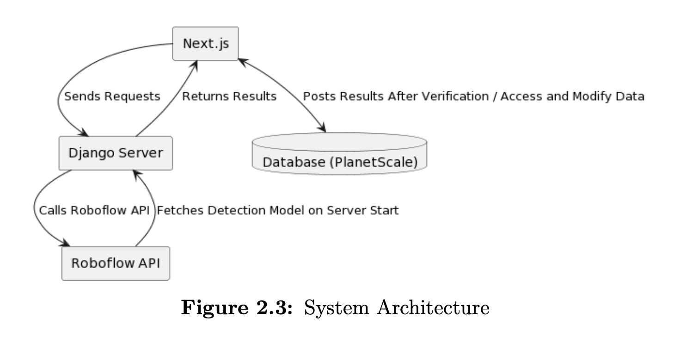

# 🧾✨ Invoice OCR & Parsing System

An end-to-end AI system for extracting structured information from **invoices and receipts**
using object detection 🤖 + OCR 🔍, wrapped in a friendly web interface 💻.

This repository is the **project hub** 🧠  
→ it explains how everything fits together and links to the actual code.

## 📁 Repositories

This project is split into two main code repositories:

- 📂 **frontend/**  
  🎨 Next.js application (UI, upload, review, correction)  
  👉 https://github.com/AhmedBhiri/Invoice-parser

- 📂 **backend/**  
  🧠 Django API + ML & OCR pipeline (YOLO + Tesseract)  
  👉 https://github.com/AhmedBhiri/invoice-parser-ml-backend

---

## 💡 What is this?

Invoices and receipts come in **many layouts** 😵‍💫  
Hard-coded templates break. Quickly.

This project uses a **layout-agnostic approach**:

✨ Detect relevant regions on the document  
✨ Read text only where it matters  
✨ Turn messy documents into clean, structured data  

All powered by modern computer vision and OCR.

---

## 🧩 Project Structure

## 🧠 System Architecture

The following diagram shows the high-level architecture of the system
and how the frontend, backend, ML pipeline, and external services interact.

### 🎨 Frontend — Application Layer
**Next.js web app**

- Upload invoices & receipts 📤
- Send documents to the backend API 🌐
- Display extracted fields 🧾
- Review & correct results ✍️

📂 [frontend](https://github.com/AhmedBhiri/Invoice-parser)  

---

### 🧠 Backend — ML & OCR Pipeline
**Django-based API**

- PDF → image preprocessing 🖼️
- Object detection using YOLO (v5 / v8) 🎯
- OCR with Tesseract 🔍
- Post-processing & field parsing 🧮
- JSON responses for the frontend 📦

📂 [backend](https://github.com/AhmedBhiri/invoice-parser-ml-backend)

---

## 🔄 How it all works (high level)

1️⃣ User uploads a document in the frontend  
2️⃣ Frontend sends it to the backend  
3️⃣ Backend runs the ML + OCR pipeline  
4️⃣ Structured JSON is returned  
5️⃣ Frontend displays results for review & export  

📐 See `ARCHITECTURE.md` for a visual diagram.

---

## 🛠️ Tech Stack

### Frontend 💅
- Next.js
- TypeScript
- Tailwind CSS
- Prisma

### Backend / ML 🤖
- Python
- Django
- PyTorch
- YOLOv5 / YOLOv8
- Tesseract OCR

---

## 🎓 Academic Context

This project was developed as part of a **Bachelor’s Graduation Project (2022–2023)**  
focused on applying deep learning techniques to real-world document automation.

The public repositories contain **sanitized, demo-safe versions** only 🧼

---

## 🔐 Data & Privacy

- ❌ No real invoices  
- ❌ No client data  
- ❌ No secrets or API keys  
- ✅ Only anonymized or synthetic examples  

Use it, learn from it, build cool things.

EOF
